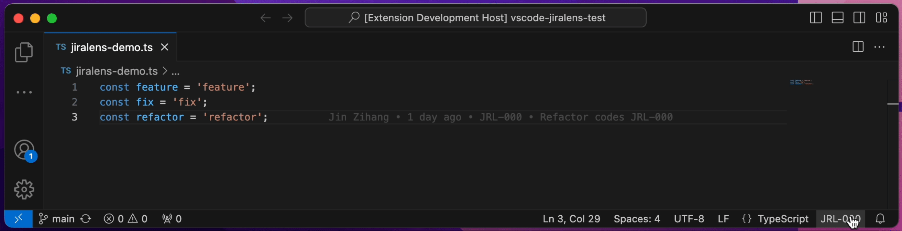
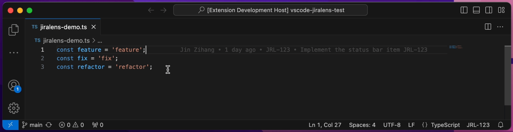
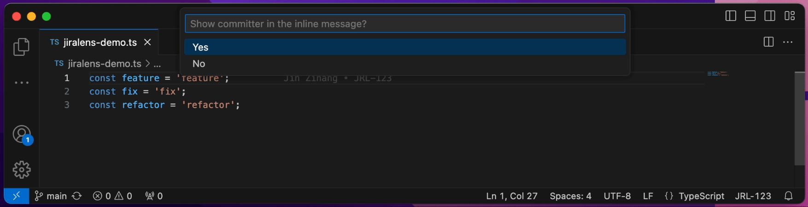
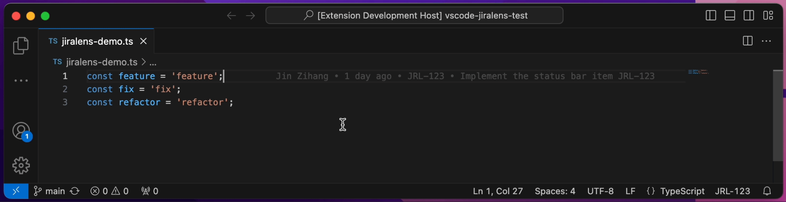
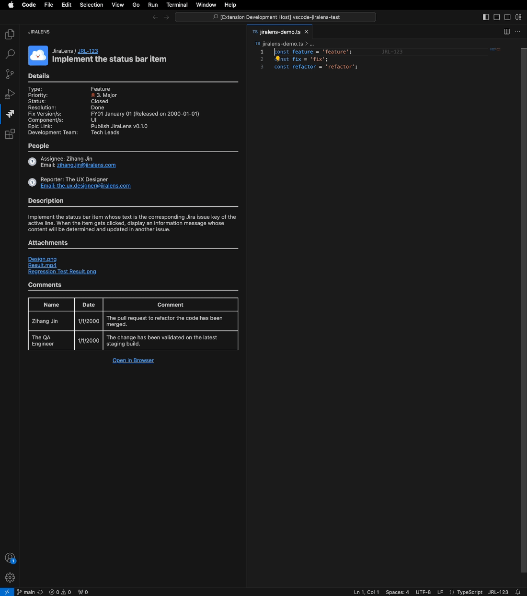
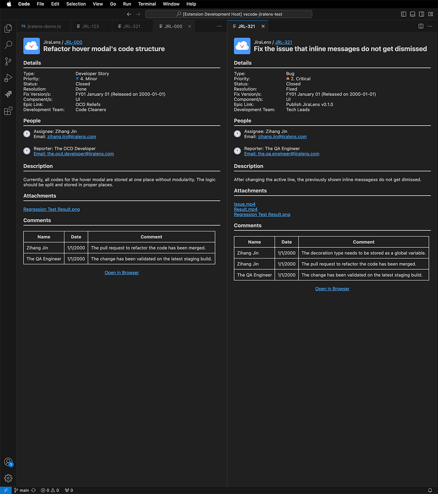
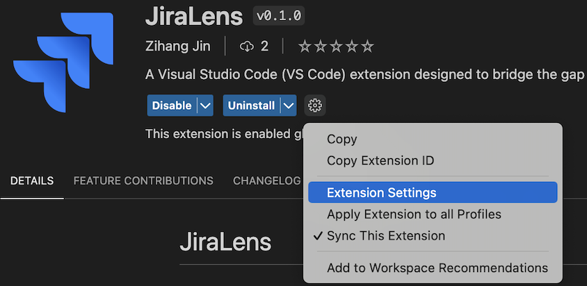

# JiraLens

Welcome to JiraLens, an open-source project fueled by community collaboration. Here are our [contribution guidelines](https://github.com/JinZihang/vscode-jiralens/blob/4d985ffdb3ece5f4849ecec7e4d67d4b56c4af41/CONTRIBUTING.md).

Encountering challenges or envisioning new features? Share your experiences and thoughts with us through [GitHub issues](https://github.com/JinZihang/vscode-jiralens/issues). Your feedback is invaluable in shaping the future of JiraLens!

## List of Contents

- [Introduction](#introduction 'Jump to Introduction')
  - [Overview](#overview 'Jump to Overview')
  - [Why JiraLens?](#why-jiralens 'Jump to Why JiraLens?')
- [Features](#features 'Jump to Features')
  - [Status Bar Item](#status-bar-item 'Jump to Status Bar Item')
  - [Inline Message](#inline-message 'Jump to Inline Message')
  - [Hover Modal](#hover-modal 'Jump to Hover Modal')
  - [Activity Bar Webview](#activity-bar-item 'Jump to Activity Bar Webview')
  - [Issue Tab](#issue-tab 'Jump to Issue Tab')
  - [Comprehensive Commands](#comprehensive-commands 'Jump to Comprehensive Commands')
- [Extension Setup](#extension-setup 'Jump to Extension Setup')
  - [Jira Host](#jira-host 'Jump to JiraHost')
  - [Bearer Token (Personal Access Token)](#bearer-token-personal-access-token 'Jump to Bearer Token (Personal Access Token)')
  - [Project Keys](#project-keys 'Jump to Project Keys')
- [Known Issues](#known-issues 'Jump to Known Issues')

## Introduction

### Overview

JiraLens is a Visual Studio Code (VS Code) extension tailored for developers seeking deeper insights into their codebase. It serves as a bridge between your code and the comprehensive information available on Jira pages.

### Why JiraLens?

While extensions like GitLens offer valuable insights already, they often fall short of the wealth of information found on Jira. JiraLens seamlessly integrates with Jira pages, providing quick access to crucial details, such as the broader objective, the fix version of the change, and more.

## Features

### Status Bar Item

Seamlessly open Jira issues in a dedicated VS Code tab or your preferred external browser.



### Inline Message

Receive quick information about the committer, relative commit time, Jira issue key, and commit message.



The content of the inline message can be easily configured.



### Hover Modal

Gain instant, essential information about the Jira issue while hovering over the inline message.



### Activity Bar Item

Experience automatic updates and display of Jira issue content for the active line, ensuring a seamless workflow.



### Issue Tab

Effortlessly review multiple Jira issues side by side for comprehensive project management.



### Comprehensive Commands

Easily tailor the extension settings to suit your preferences with a simple and intuitive configuration approach.

```
// Type VS Code commands using: Ctrl/Command + Shift + P
// Available commands:
Set the Jira Host
Set the Bearer Token (Personal Access Token) for Jira Authentication
Add a Jira Project Key
Delete a Jira Project Key
Set Whether to Show the Committer in Inline Message
Set Whether to Show the Relative Commit Time in Inline Message
Set Whether to Show the Jira Issue Key in Inline Message
Set Whether to Show the Commit Message in Inline Message
```

## Extension Setup

To ensure proper functionality, JiraLens requires the Jira host, the Jira authentication token, and project keys to be configured. Additionally, ensure Jira issue keys are included in commit messages, as they are extracted from there.

You can customize the extension settings either using the VS Code settings editor or by utilizing the commands mentioned above.



### Jira Host

If your Jira address begins with `https://jira.jiralens.com/...`, then set the Jira host as `jira.jiralens.com`.

### Bearer Token (Personal Access Token)

Navigate to your Jira profile page, access the Personal Access Tokens tab, and generate a token by clicking the corresponding button.

### Project Keys

Refer to [this documentation](https://support.atlassian.com/jira-software-cloud/docs/what-is-an-issue/) for the definition of Jira issue key and Jira project key. If an issue's key is `JRL-123`, then its corresponding project key is `JRL`.

## Known Issues

1. Some Jira markdowns like colored texts cannot be rendered, when they exist in the content, Jira issue details will stuck at loading.
2. After forward-deleting to pull the next line to the current line, it takes a short while for the inline message to udpdate its position.
